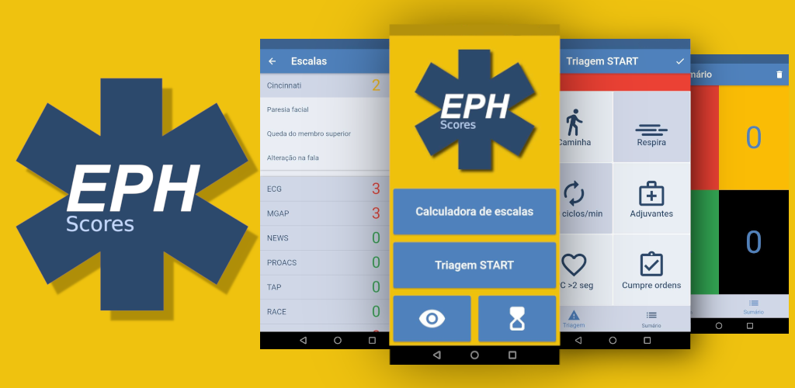

# EPHScores

## **O que é ?**

### EPHScores é uma aplicação cujo objetivo é ajudar profissionais de saúde a realizar avaliação de vítimas, com base no cálculo de escalas de emergência, de forma rápida e simples !

### Para além disso ainda oferece a possibilidade de realizar triagem START e guardar o número de vítimas, organizadas por gravidade.

## **Construido usando** 

## **Sistema operativo**
### Uma vez que construido com Flutter, a aplicação estará disponível tanto para Android como para IOS

- [ ] Google Play (In review)
- [ ] App Store

 

### Se esperar não for o teu forte e usares Android, poderás descarregar a APK, diretamente do link abaixo

## **Design**

De forma a que a *user interface* fosse o mais simples possivel e similar entre dispositivos, é utilizado tema e componentes *MATERIAL UI*

### **README built with**

